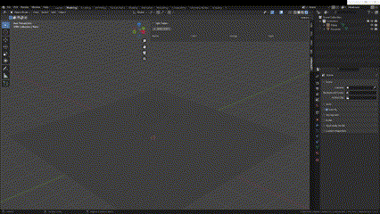

English document is [here](./docs/README_en.md) .

---  

# Light Helper
* Light Helper は、シーン上のライトの操作を補助する Blender のアドオンです。

# 機能
* シーン上にライトを追加可能です。  
  * 追加の際、ライトの種類を指定できます。
* シーン上のライトのプロパティを操作可能です。操作可能なプロパティは以下です。  
  * ライトの色
  * ライトの強さ
  * ライトの種類
* シーン上のライトを削除可能です。

# 導入方法
* アドオンをダウンロード
* Edit > Preferences > Add-ons > install 
* ダウンロードしたアドオンを指定。 

# デモ

