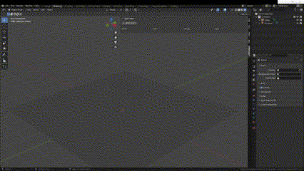

# Light Helper
* Light Helper is an add-on for Blender that helps you manipulate lights in your scene.

# Features
* Lights can be added on the scene.
   * When adding, you can specify the type of light.
* Manipulate the properties of lights on the scene. The properties that can be manipulated are as follows.
   * light color
   * light intensity
   * light type
* You can delete lights on the scene.

# How to install
* Download Add-ons
* Edit > Preferences > Add-ons > install
* Specify the downloaded add-on.

# Demo
